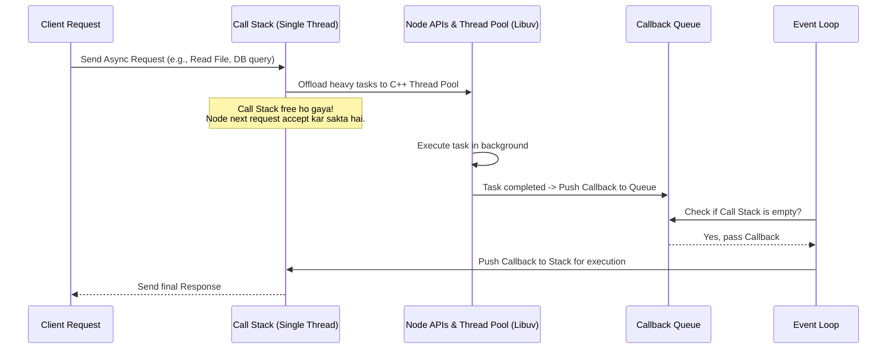

# 🟢 Node.js Core Basics & Architecture (Hinglish)

Welcome Gaurav! Node.js seekhne ka yeh sabse pehla aur basic step hai. Chaliye isko in-depth samajhte hain.

---

## 🧐 Node.js Kya Hai? (What is Node.js?)

Kayi log sochte hain ki Node.js ek programming language hai ya framework hai, par aisa nahi hai.
* **Node.js ek JavaScript Runtime Environment hai.**
* Yeh Google ke open-source **V8 Engine** par built hai.
* Node.js se pehle, JavaScript sirf browser (like Chrome, Firefox) ke andar hi chal sakti thi. Node.js ne JS ko browser se bahar nikala aur computer par directly run karne ki capability di. Ab hum JS se servers, databases aur desktop applications bana sakte hain.

---

## ⚙️ Node.js Kaise Kaam Karta Hai? (Node.js Architecture)

Node.js ke teen main features hain jo ise fast aur efficient banate hain:
1. **Single-Threaded**: Ek time par ek hi main thread (process) run hota hai.
2. **Non-Blocking / Asynchronous I/O**: Kisi heavy task (jaise Database query ya File read) ke complete hone ka wait kiye bina, Node.js next request ko handle karne lagta hai.
3. **Event-Driven**: Har action (jaise click, request, error) ko ek event mana jata hai aur unke callback functions trigger hote hain.

---

## 🌀 Event Loop Flow Diagram

Node.js background mein heavy operations ko **Libuv (C++ library)** aur **Thread Pool** ke zariye handle karta hai. Niche iska visual workflow dekhiye:



---

## 🔄 Event Loop ke Components (In-Depth)

1. **Call Stack**: Yahan aapka normal JavaScript code execute hota hai (LIFO - Last In First Out format mein). Agar stack mein koi task chal raha hai, toh jab tak wo complete nahi hota, stack block rehta hai.
2. **Node APIs (Background Threads)**: Jab hum koi asynchronous task (like `fs.readFile` ya `setTimeout`) chalate hain, toh Node.js use main thread se hata kar background worker threads (Libuv) ko de deta hai.
3. **Callback Queue / Task Queue**: Jab background thread task complete kar leta hai, toh uska execution code (callback function) is queue mein aakar khada ho jata hai.
4. **Event Loop**: Yeh ek continuous running loop hai. Iska kaam hai check karna ki **Call Stack** empty hai ya nahi. Agar Call Stack empty hai, toh yeh **Callback Queue** se pehle task ko uthakar Call Stack mein bhej deta hai execution ke liye.

### 📊 Runtime Components Comparison (Table):

| Component | Responsibility (Kaam) | Thread Type | Execution Type |
| :--- | :--- | :--- | :--- |
| **Call Stack** | Runs standard synchronous JavaScript code line-by-line. | Single Main Thread | LIFO (Last In, First Out) |
| **Node APIs (Libuv)** | Handles background tasks (like DB queries, file reads, networking). | C++ Worker Threads | Multithreaded |
| **Callback Queue** | Stores completed background tasks' callbacks waiting to run. | Queue Storage | FIFO (First In, First Out) |
| **Event Loop** | Constantly monitors Call Stack and routes Callbacks from Queue. | Single Main Thread | Infinite loop |

---

## 📝 Example: Blocking vs Non-Blocking Code

### 🔴 Blocking Code (Synchronous) - Bad for Web Servers
```javascript
const fs = require('fs');

// Jab tak file read nahi hoti, code aage nahi badhega (Server Block ho jayega)
const data = fs.readFileSync('large_file.txt', 'utf-8'); 
console.log(data);
console.log("Yeh message file read hone ke BAAD print hoga");
```

### 🟢 Non-Blocking Code (Asynchronous) - Node.js Standard
```javascript
const fs = require('fs');

// File background mein read hogi, execution aage chalta rahega
fs.readFile('large_file.txt', 'utf-8', (err, data) => {
    if (err) throw err;
    console.log(data); // Yeh background task complete hone par chalega
});

console.log("Yeh message file read hone se PEHLE hi print ho jayega!");
```

---

## 💡 Quick Summary
* Node.js **V8 Engine** use karke JS code ko direct machine code mein convert karta hai.
* Heavy I/O operations ko background threads mein offload kar diya jata hai taaki main stack hamesha free rahe.
* **Event Loop** is physical routing ko automatic run karta hai, jisse Node.js thousands of concurrent connections bina crash kiye handle kar leta hai.
