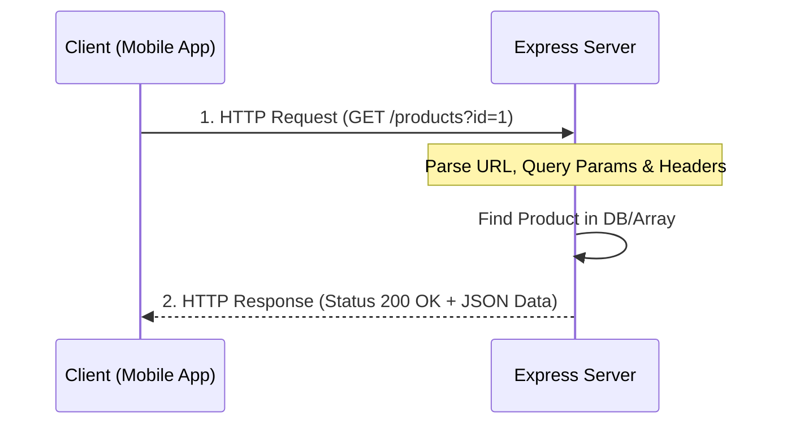

# 🔵 Express.js Routing & HTTP Concepts (Hinglish)

Express.js kya hai, client-server communication kaise hota hai, aur routing kaise manage ki jati hai—chaliye isko aasan bhasha mein samajhte hain.

---

## 🧐 Express.js Kya Hai? (What is Express.js?)

Node.js mein web server banane ke liye built-in `http` module hota hai, lekin usme bohot sara boilerplate code likhna padta hai (jaise manually URL check karna, headers parse karna).
* **Express.js ek minimal and flexible web application framework hai** jo Node.js ke upar bana hai.
* Yeh routing, request handling, middleware support, aur response formats ko manage karna bohot simple bana deta hai.

---

## 🌐 HTTP Requests and Response Cycle

Server and Client (mobile/web app) ke beech saari baatein **HTTP Protocol** ke zariye hoti hain. 



---

## 🚦 HTTP Methods (Verbs)

Express routing mein hum primarily 4 main HTTP methods use karte hain:

1. **GET**: Server se data fetch (receive) karne ke liye. (E.g., Getting list of products).
2. **POST**: Server par naya data send (create) karne ke liye. (E.g., User Register, User Login).
3. **PUT / PATCH**: Existing data ko update karne ke liye.
4. **DELETE**: Server se data delete karne ke liye.

---

## 📥 Request Object (`req` in Express)

Jab mobile app server ko request bhejta hai, toh client ki bheji hui details **`req`** object ke andar milti hain. Iske 4 main components hote hain:

### 1. `req.body`
* **Kya hai**: User ka hidden data jo security reasons se URL mein nahi dikhaya jata (usually JSON format mein).
* **Use case**: Login Credentials, Registration form details.
* **Code Example**:
  ```typescript
  // Post request body extract karna
  app.post("/register", (req, res) => {
      const { username, email, password } = req.body;
      console.log(username); // "Gaurav"
  });
  ```

### 2. `req.params`
* **Kya hai**: URL ke path parameter variables jo colon (`:`) se routes mein define hote hain.
* **Use case**: Specific resource ID pass karne ke liye.
* **Route**: `/products/:id` ➡️ Client Request: `/products/45`
* **Code Example**:
  ```typescript
  app.get("/products/:id", (req, res) => {
      const productId = req.params.id; // "45"
  });
  ```

### 3. `req.query`
* **Kya hai**: URL ke end mein query string parameters jo question mark (`?`) aur key-value pair ke saath hote hain.
* **Use case**: Search terms, filtering, paging.
* **Route**: `/getdevice` ➡️ Client Request: `/getdevice?userid=60c72b2f`
* **Code Example**:
  ```typescript
  app.get("/getdevice", (req, res) => {
      const userid = req.query.userid; // "60c72b2f"
  });
  ```

### 4. `req.headers`
* **Kya hai**: Metadata jo request ke header section mein bhejte hain (jaise client type, token verification details).
* **Use case**: JWT Token verify karne ke liye authorization header.
* **Code Example**:
  ```typescript
  app.get("/profile", (req, res) => {
      const authHeader = req.headers.authorization; // "Bearer eyJhbG..."
  });
  ```

### 📊 Request Data extraction comparison (Table):

| Request Property | Passed Where? | Format | Sample Request URL / Data | Express Code |
| :--- | :--- | :--- | :--- | :--- |
| **`req.body`** | Hidden in Request Body | JSON Object | `{ "email": "g@t.com", "password": "123" }` | `req.body.email` |
| **`req.params`** | Inside URL Route Path | URL Segments | `/products/45` (mapped to route `/products/:id`) | `req.params.id` |
| **`req.query`** | At URL end after `?` | Key-value string | `/getdevice?userid=60c72b2f` | `req.query.userid` |
| **`req.headers`** | In HTTP Request Headers | Headers Object | `Authorization: Bearer eyJhbGci...` | `req.headers.authorization` |

---

## 📤 Response Object (`res` in Express)

Server process complete hone par client ko **`res`** object ke zariye data wapas bhejta hai.

1. **`res.status(code)`**: HTTP Status Code set karne ke liye:
   - `200`: Success (OK)
   - `210/201`: Created successfully
   - `400`: Bad Request (Invalid data sent)
   - `401`: Unauthorized (No/Invalid token)
   - `404`: Not Found (Route ya data nahi mila)
   - `500`: Internal Server Error (Database failed, logic error)
2. **`res.json(data)`**: Client ko clean JSON objects response return karne ke liye.

```typescript
res.status(200).json({
  success: true,
  message: "Product found",
  data: { id: 1, name: "One Plus" }
});
```
