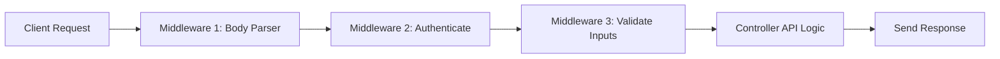
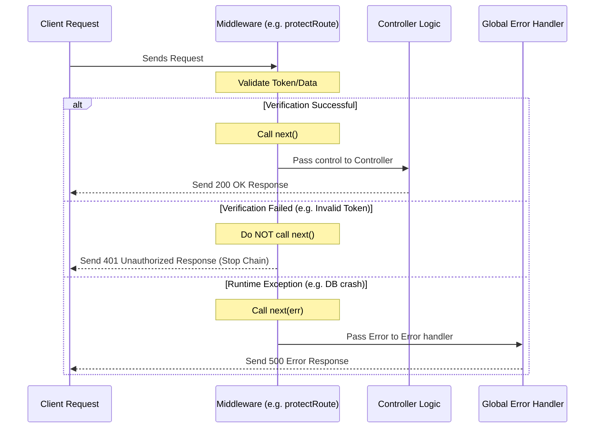

# 🛠️ Express Middleware & Global Error Handling (Hinglish)

Express mein **Middleware** aur **Global Error Handling** do aisi powers hain jo aapke code ko clean, reusable aur secure banati hain. Chaliye inhe detail mein samajhte hain.

---

## 🚦 Middleware Kya Hota Hai? (What is Middleware?)

Middleware ko aap ek **"Checkpost / Filter"** ki tarah samajh sakte hain. Jab client server ko request bhejta hai, toh controller function chalne se PEHLE request in checkposts se guzarti hai.



## 🔄 next() Function Kya Hai aur Yeh Kyun Zaroori Hai?

Express.js mein, middleware functions tab tak aage nahi badhte jab tak aap manually **`next()`** function ko call nahi karte. 
* Agar aap `next()` call karna bhool gaye, toh aapki request hanging state mein chali jayegi (loading loop chalta rahega) aur client timeout ho jayega.
* **`next()` with arguments**: Agar aap `next(error)` ke andar koi value pass karte hain, toh Express samajh jata hai ki koi error aayi hai. Yeh beech ke saare normal routes aur middlewares ko skip karke direct **Global Error Handler** middleware (4 arguments wale) par jump kar jata hai.

### 🔄 Middleware Pass vs Fail Lifecycle:



---

## 📐 app.ts Configuration & Layout Rules

Ek professional Express architecture mein [app.ts](file:///c:/Gaurav/backend/backend-learning/src/app.ts) ka setup is hierarchy mein hona chahiye:

1. **Global Parsers (Top)**: incoming body content ko parse karne wale checkposts (e.g., `app.use(express.json())`).
2. **Routes Mount (Middle)**: application API endpoints definition (e.g., `app.use("/", router)`).
3. **Error Middleware (Bottom)**: Yeh hamesha file ke end mein, saare routes ke baad mount hona chahiye. Agar yeh routes se pehle rakh diya, toh yeh kabhi trigger nahi hoga kyunki request routes tak pahunchne se pehle hi error route pass ho jayega.

---

## 📊 Middleware Types & Use Cases (Table)

| Middleware Type | Mounting Code | Purpose / Use Case |
| :--- | :--- | :--- |
| **Global Level** | `app.use(express.json())` | Har request par execute hota hai. Parses JSON body parameters. |
| **Route/Router Level** | `router.use("/auth", authRouter)` | Specific group of endpoints par hi validation or checks run karta hai. |
| **Endpoint Level** | `router.get("/", protectRoute, getdevice)` | Kisi ek particular URL coordinate ko block ya validate karne ke liye. |
| **Error Handling Level** | `app.use(globalErrorHandler)` | Saare runtime errors catch karke uniform status code returns setup karta hai. |

---

## 🛡️ Types of Middleware in Express

### 1. Built-in Middlewares
Jaise `express.json()`. Yeh incoming raw text requests ko automatic JSON main parse kar deta hai.
```typescript
app.use(express.json()); // Mounts globally
```

### 2. Custom Authentication Middleware
Aapke project mein [auth.middleware.ts](file:///c:/Gaurav/backend/backend-learning/src/middleware/auth.middleware.ts) iska solid example hai:
```typescript
export const protectRoute = (req: AuthenticatedRequest, res: Response, next: NextFunction): void => {
  const authHeader = req.headers.authorization;
  if (!authHeader) {
     res.status(401).json({ success: false, message: "No token provided" });
     return; // response yahi se return, next() execute nahi hoga!
  }
  // JWT verification successfully hone par:
  req.user = decodedUser;
  next(); // Request aage controller function pe chali jayegi
};
```

### 3. Custom Input Validation Middleware
Aapke project mein [validate.middleware.ts](file:///c:/Gaurav/backend/backend-learning/src/middleware/validate.middleware.ts) standard Zod validation process karta hai. Controller logic run hone se pehle check ho jata hai ki body structure correct hai ya nahi.

---

## 💥 Global Error Handling (Advanced Practice)

Agar aap har controller ke code mein manually `try-catch` lagayenge, toh controller file duplicate lines se bhar jayegi aur use maintenance karna impossible ho jayega.

Aapke project mein humne ek centralized error tracking pattern use kiya hai jo 3 components par chalta hai:

### 1. Custom `AppError` Class
Normal Error class ko extend karke humne status codes aur static errors manage karne ke liye [appError.ts](file:///c:/Gaurav/backend/backend-learning/src/utils/appError.ts) banaya:
```typescript
export class AppError extends Error {
  constructor(public message: string, public statusCode: number) {
    super(message);
    Object.setPrototypeOf(this, new.target.prototype);
  }
}
```

### 2. Async Handler Wrapper (`asyncHandler`)
Yeh wrapper functions controller ke functions ko wrap karta hai. Agar controller mein kahin bhi error aati hai (jaise `throw new AppError("User not found", 404)`), toh use automatically catch karke checkpost (Express `next()`) ke paas bhej deta hai.
```typescript
export const asyncHandler = (fn: Function) => {
  return (req: Request, res: Response, next: NextFunction) => {
    Promise.resolve(fn(req, res, next)).catch(next); // catches error & passes to next()
  };
};
```

### 3. Global Error Handling Middleware
Express tabhi kisi middleware ko error handler ki tarah treat karta hai jab use **exactly 4 parameters** diye jayein (`err, req, res, next`). 

Check out [error.middleware.ts](file:///c:/Gaurav/backend/backend-learning/src/middleware/error.middleware.ts):
```typescript
export const globalErrorHandler = (
  err: any,
  req: Request,
  res: Response,
  next: NextFunction
): void => {
  const statusCode = err.statusCode || 500;
  const message = err.message || "Internal server error";

  res.status(statusCode).json({
    success: false,
    message,
    stack: process.env.NODE_ENV === "development" ? err.stack : undefined,
  });
};
```

### How they work together:
Controller mein sirf logic likhein aur throws execute karein:
```typescript
export const getUser = asyncHandler(async (req: Request, res: Response) => {
  const user = await User.findOne({ email: req.body.email });
  if (!user) {
    throw new AppError("User not found", 404); // Caught by asyncHandler -> sent to globalErrorHandler
  }
  res.status(200).json({ success: true, data: user });
});
```
Isse backend stability bohot improve hoti hai aur single standard error template poori app pe client side implement ho jati hai.
