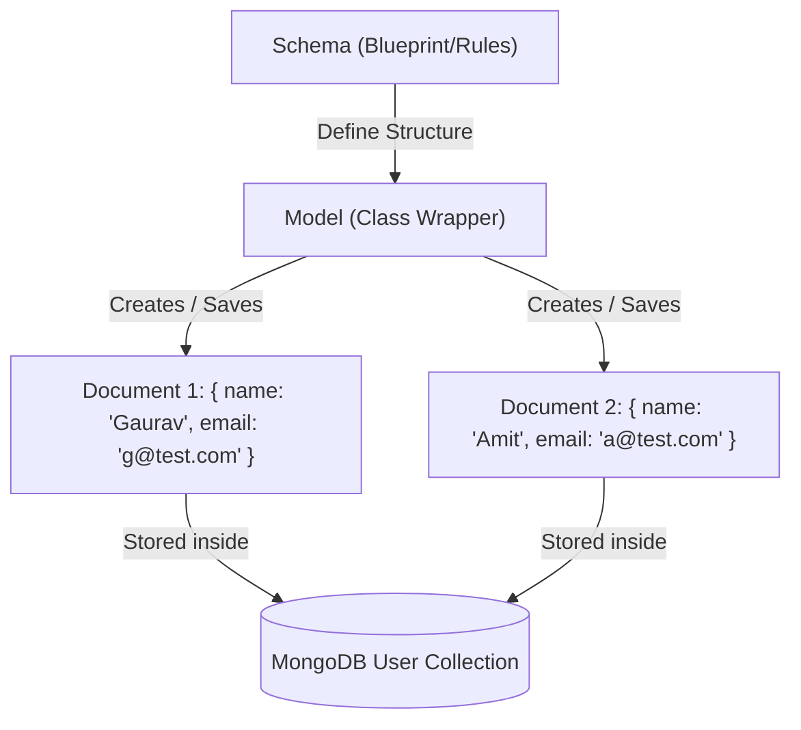

# 💾 MongoDB & Mongoose Database Concepts (Hinglish)

Backend web development mein database ek core component hota hai jahan application ka persistence state save hota hai. Chaliye **MongoDB** aur **Mongoose** ko in-depth aur simple terms mein samajhte hain.

---

## 💾 MongoDB vs Relational Database (SQL)

| Feature | Relational Databases (SQL - e.g., MySQL, Postgres) | MongoDB (NoSQL) |
| :--- | :--- | :--- |
| **Data Format** | Tables, Rows & Columns mein stored hota hai. | JSON-like Documents (BSON) mein stored hota hai. |
| **Schema** | Rigid/Fixed Schema. Har row ka structure strictly same hona chahiye. | Flexible Schema. Different documents ke fields alag ho sakte hain. |
| **Scalability** | Vertical Scaling (Server RAM/CPU badhana). | Horizontal Scaling (More database servers add karna). |

**MongoDB** documents key-value pairs par chalte hain, jo web developers ko JSON format ke bohot close rakhta hai. Is wajah se Node.js aur MongoDB ka configuration bohot natural and fast feel hota hai.

---

## 🔌 Mongoose Kya Hai? (What is Mongoose?)

* **Mongoose ek ODM (Object Document Mapper) library hai** Node.js aur MongoDB ke liye.
* Yeh humein raw MongoDB queries likhne ke bajaye humare database structures ko JavaScript objects (Classes) ke tarah define aur manipulate karne mein help karti hai.
* Mongoose schema validation, querying, relations modeling aur middleware hooks support karti hai.

---

## 📐 Schema vs Model

Mongoose mein do key terms hote hain jo hamesha use hote hain:
1. **Schema**: Blueprint/Structure. Yeh define karta hai ki database table (collection) ke andar kaun-kaun se fields honge, unka data-type kya hoga (String, Number, Date, etc.) aur validations (unique, lowercase, custom validation rules).
2. **Model**: Class/Wrapper built on Schema. Schema define hone ke baad hum ek **Model** generate karte hain. Model humein data create karne, search karne, delete aur update karne ki properties deta hai (jaise `User.find()`, `Device.create()`).

### 📊 Schema, Model, aur Document ke beech ka relation:



---

## 🛠️ Deep Dive into Models in PulseSync/Backend

### 1. User Model Schema ([user.model.ts](file:///c:/Gaurav/backend/backend-learning/src/models/user.model.ts))
Mongoose schema code look:
```typescript
import mongoose from "mongoose";

const userSchema = new mongoose.Schema({
  username: { 
    type: String, 
    required: [true, "Username is required"], 
    trim: true 
  },
  email: { 
    type: String, 
    required: true, 
    unique: true, // index dynamic banata hai and duplicates fail karta hai
    lowercase: true 
  },
  password: { 
    type: String, 
    required: true 
  }
});

const User = mongoose.model("User", userSchema);
export default User;
```

### 2. Relational Reference - Device Model Schema ([device.model.ts](file:///c:/Gaurav/backend/backend-learning/src/models/device.model.ts))
Agar ek user ke paas multiple device logins hain, toh device database schema ko user data se link karna hoga using **Mongoose Relationships**:
```typescript
const deviceSchema = new mongoose.Schema({
  userId: {
    type: mongoose.Schema.Types.ObjectId,
    ref: "User", // This refers to the 'User' model
    required: true
  },
  pushtoken: { type: String, required: true, unique: true },
  os: { type: String, default: "unknown" },
  devicename: { type: String, default: "unknown" },
  appversion: { type: String, default: "1.0.0" }
});
```
`ref: "User"` validation framework ko batata hai ki `userId` field user collection ke data ko map kar rahi hai.

---

## 📝 Mongoose Functions Comparison (Table)

| Function Name | Purpose | Returns | When to use? |
| :--- | :--- | :--- | :--- |
| **`create(data)`** | Database mein ek ya multiple naye documents insert karne ke liye. | Created document(s) | Registration ya new product creation ke time. |
| **`find(query)`** | Matching query ke saare documents search karne ke liye. | Array of documents `[]` (if none match, returns `[]`) | Kisi user ke multiple devices, ya product lists show karne ke liye. |
| **`findOne(query)`** | Sirf pehla matching document retrieve karta hai. | Single document object or `null` | Login ke time user email search karne ke liye. |
| **`findById(id)`** | Specific MongoDB hex ID se search karta hai. | Single document object or `null` | Profile fetching, details show routes ke liye. |
| **`updateOne(filter, update)`**| Filter matched single document ko silently update karta hai. | Status object (`acknowledged`, `modifiedCount`) | Counter increment, settings update karne ke liye. |
| **`findOneAndUpdate(...)`** | Single document matching query update karta hai aur return karta hai. | Updated document structure (options default matches old data) | Upsert operation or returning updated object status. |
| **`deleteOne(query)`** | Pehla matching document delete karta hai. | Status object (`deletedCount`) | Single device token deletion, single cart item remove. |
| **`deleteMany(query)`** | Saare matching documents delete karta hai. | Status object (`deletedCount`) | Purani log files delete karne ke liye, clear all cart. |

---

## 🔗 Relations: Mongoose `.populate()`

PulseSync backend mein humne `Device` model ko `User` model ke sath associate kiya hua hai:
```typescript
userId: { type: mongoose.Schema.Types.ObjectId, ref: "User" }
```

### 🧐 Populate Kyun aur Kaise Use Karte Hain?
Agar hum simple query karenge:
```typescript
const device = await Device.findOne({ pushtoken: "token123" });
console.log(device.userId); // Output: "60c72b2f" (Sirf ID milegi)
```
Agar humein device ke sath user ka full details (username, email) bhi dikhana ho, toh hum do separate queries chalane ke bajaye `.populate()` function use karte hain. 

Mongoose background mein automatic JOIN perform karke data merge kar deta hai:

```typescript
// 1. Fetch device details along with the associated User data
const deviceWithUser = await Device.findOne({ pushtoken: "token123" }).populate("userId");

console.log(deviceWithUser.userId.username); // Output: "Gaurav"
console.log(deviceWithUser.userId.email);    // Output: "gaurav@example.com"
```

### 🔒 Selection of fields in Populate (Pro-tip):
Agar hum pure User schema ko load karenge toh password hash aur sensitve data bhi API response mein leak ho jayega. Hum select parameters pass karke specific fields populate kar sakte hain:
```typescript
// Fetch user details but exclude password field
const deviceWithFilteredUser = await Device.findOne({ pushtoken: "token123" })
  .populate("userId", "username email"); // Only loads username & email
```

---

## 🚦 Mongoose Query Flow Diagram

```mermaid
graph TD
    Client[Client Query] --> MongooseModel[Mongoose Model Wrapper]
    MongooseModel --> QueryType{Query Type?}
    
    QueryType -->|find| ReturnArray[Returns Array: `[`Doc1, Doc2`]`]
    QueryType -->|findOne / findById| ReturnDoc[Returns Object: `Doc1` or `null`]
    QueryType -->|populate| PerformJoin[Join ref Table -> Returns Merged Object]
    
    ReturnArray --> ClientResponse[Client Response]
    ReturnDoc --> ClientResponse
    PerformJoin --> ClientResponse
```

