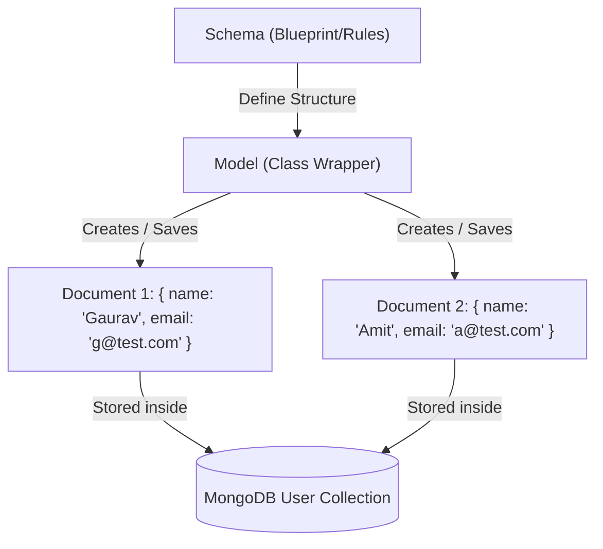

# 💾 MongoDB & Mongoose Database Concepts (Hinglish)

Backend web development mein database ek core component hota hai jahan application ka persistence state save hota hai. Chaliye **MongoDB** aur **Mongoose** ko in-depth aur simple terms mein samajhte hain.

---

## 💾 MongoDB vs Relational Database (SQL)

| Feature | Relational Databases (SQL - e.g., MySQL, Postgres) | MongoDB (NoSQL) |
| :--- | :--- | :--- |
| **Data Format** | Tables, Rows & Columns mein stored hota hai. | JSON-like Documents (BSON) mein stored hota hai. |
| **Schema** | Rigid/Fixed Schema. Har row ka structure strictly same hona chahiye. | Flexible Schema. Different documents ke fields alag ho sakte hain. |
| **Scalability** | Vertical Scaling (Server RAM/CPU badhana). | Horizontal Scaling (More database servers add karna). |

**MongoDB** documents key-value pairs par chalte hain, jo web developers ko JSON format ke bohot close rakhta hai. Is wajah se Node.js aur MongoDB ka configuration bohot natural and fast feel hota hai.

---

## 🔌 Mongoose Kya Hai? (What is Mongoose?)

* **Mongoose ek ODM (Object Document Mapper) library hai** Node.js aur MongoDB ke liye.
* Yeh humein raw MongoDB queries likhne ke bajaye humare database structures ko JavaScript objects (Classes) ke tarah define aur manipulate karne mein help karti hai.
* Mongoose schema validation, querying, relations modeling aur middleware hooks support karti hai.

---

## 📐 Schema vs Model

Mongoose mein do key terms hote hain jo hamesha use hote hain:
1. **Schema**: Blueprint/Structure. Yeh define karta hai ki database table (collection) ke andar kaun-kaun se fields honge, unka data-type kya hoga (String, Number, Date, etc.) aur validations (unique, lowercase, custom validation rules).
2. **Model**: Class/Wrapper built on Schema. Schema define hone ke baad hum ek **Model** generate karte hain. Model humein data create karne, search karne, delete aur update karne ki properties deta hai (jaise `User.find()`, `Device.create()`).

### 📊 Schema, Model, aur Document ke beech ka relation:



---

## 🛠️ Deep Dive into Models in PulseSync/Backend

### 1. User Model Schema ([user.model.ts](file:///c:/Gaurav/backend/backend-learning/src/models/user.model.ts))
Mongoose schema code look:
```typescript
import mongoose from "mongoose";

const userSchema = new mongoose.Schema({
  username: { 
    type: String, 
    required: [true, "Username is required"], 
    trim: true 
  },
  email: { 
    type: String, 
    required: true, 
    unique: true, // index dynamic banata hai and duplicates fail karta hai
    lowercase: true 
  },
  password: { 
    type: String, 
    required: true 
  }
});

const User = mongoose.model("User", userSchema);
export default User;
```

### 2. Relational Reference - Device Model Schema ([device.model.ts](file:///c:/Gaurav/backend/backend-learning/src/models/device.model.ts))
Agar ek user ke paas multiple device logins hain, toh device database schema ko user data se link karna hoga using **Mongoose Relationships**:
```typescript
const deviceSchema = new mongoose.Schema({
  userId: {
    type: mongoose.Schema.Types.ObjectId,
    ref: "User", // This refers to the 'User' model
    required: true
  },
  pushtoken: { type: String, required: true, unique: true },
  os: { type: String, default: "unknown" },
  devicename: { type: String, default: "unknown" },
  appversion: { type: String, default: "1.0.0" }
});
```
`ref: "User"` validation framework ko batata hai ki `userId` field user collection ke data ko map kar rahi hai.

---

## 📝 Common Mongoose Queries (Cheat Sheet)

### 1. Create a Document
```typescript
const newUser = await User.create({
  username: "Gaurav",
  email: "gaurav@example.com",
  password: hashedPassword
});
```

### 2. Search / Query Data
* **Find many**:
  ```typescript
  // Finds all devices of a specific user
  const devices = await Device.find({ userId: "60c72b2f" });
  ```
* **Find one**:
  ```typescript
  // Finds user by email
  const user = await User.findOne({ email: "gaurav@example.com" });
  ```
* **Find by ID**:
  ```typescript
  const user = await User.findById("60c72b2f");
  ```

### 3. Update Data
* **Upsert (Insert if not exist / Update if exist)**:
  ```typescript
  // In user.controller.ts: Save/Update Device token
  await Device.findOneAndUpdate(
    { pushtoken: "token123" }, // search condition
    { userId: user._id, os: "android" }, // data to update
    { upsert: true, new: true } // configurations
  );
  ```

### 4. Delete Data
```typescript
await Device.deleteOne({ pushtoken: "token123" });
```
