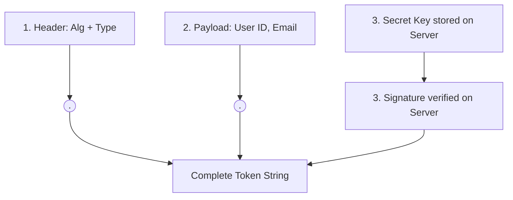

# 🔑 User Authentication & JWT Flow (Hinglish)

Authentication full-stack apps ki core functionality hai. Chaliye samajhte hain ki user credentials ko securely kaise save kiya jata hai, password verification kaise kaam karta hai, aur **JWT (JSON Web Tokens)** se secure api requests kaise maintain ki jati hain.

---

## 🔒 Hashing vs Encryption

Kayi log samajhte hain ki passwords ko encrypt karna chahiye, par best practice hai **Password Hashing**. Dono mein kya difference hai?

1. **Encryption (Two-way)**: Data ko encrypt kiya jata hai aur ek private key se use wapas original form mein decrypt (read) kiya ja sakta hai.
2. **Hashing (One-way)**: Data ko unique random mathematical key (hash) mein change kiya jata hai. **Hash ko wapas original text mein convert nahi kiya ja sakta.**

🚨 **Hamein passwords ko hamesha Hash karna chahiye!** Agar database kabhi hack bhi ho jaye, toh hacker hashes se real password pata nahi kar sakta.

---

## 🛠️ Bcrypt - Password Hashing Library

PulseSync backend mein humne password hash karne ke liye `bcrypt` use kiya hai:

### 📊 Register aur Login Flow (Bcrypt Hashing):

```mermaid
graph TD
    subgraph Registration Flow (Salt + Hash)
        PassReg["User Input: Password ('gaurav123')"] --> Salt["Generate Salt (Random bytes)"]
        Salt --> HashFunc["Bcrypt Hash Function"]
        PassReg --> HashFunc
        HashFunc --> HashOut["Secret Hash ('$2b$10$xyz...')"]
        HashOut --> DB[("Store in MongoDB User collection")]
    end

    subgraph Login Flow (Compare Hash)
        PassLog["User Input: Password ('gaurav123')"] --> Comp["Bcrypt.compare() Function"]
        DB -->|Retrieve Stored Hash| Comp
        Comp -->|Match success| Success["Login Successful (Generate JWT)"]
        Comp -->|Match failed| Fail["Login Rejected (401 Unauthorized)"]
    end
```

### 1. Hash creation during Register ([user.controller.ts](file:///c:/Gaurav/backend/backend-learning/src/controllers/user.controller.ts#L41-L42)):
```typescript
// Salt add karne se hash aur zyada random and secure ho jata hai
const salt = await bcrypt.genSalt(10);
const hashedPassword = await bcrypt.hash(password, salt);

// Store hashedPassword inside database User model...
```

### 2. Password matching during Login ([user.controller.ts](file:///c:/Gaurav/backend/backend-learning/src/controllers/user.controller.ts#L72)):
Kyunki hash reversible nahi hai, isliye hum login data ke password ko wapas decrypted form mein match nahi kar sakte. Instead, `bcrypt` kya karta hai?
1. Client ke login request se password leta hai (e.g. "myPassword123").
2. Database se user ka stored hash code nikalta hai.
3. Login waale password ko usi salt/algorithm se match run karke output verify karta hai.
```typescript
const isMatch = await bcrypt.compare(password, user.password); // Returns true or false
```

---

## 🎟️ JWT (JSON Web Token) Kya Hai?

JWT ek standard open industry standard (RFC 7519) hai jo client aur server ke beech JSON format mein information securely pass karne mein help karta hai.

JWT stateless hota hai. Yani, har incoming request ke baad backend ko database query karne ki zaroorat nahi hoti user details check karne ke liye. Token ke andar user info signature security ke sath store ho sakti hai.

### JWT Structure (3 Parts divided by dot `.`)

Ek generic JWT aisa dikhta hai: `xxxxx.yyyyy.zzzzz`

1. **Header (xxxxx)**: Token type (JWT) aur hashing algorithm (e.g. HS256) define karta hai.
2. **Payload (yyyyy)**: Isme actual user details store hoti hain (jaise `userId`, `email`). *Tip: Isme kbhi bhi credit card info ya password jaise data mat rakhiye, kyuki ise base64 se decode kiya ja sakta hai.*
3. **Signature (zzzzz)**: Header, Payload, aur ek unique secret token key (stored on server) ko mila kar signature banta hai. Signature ensures karta hai ki client token ke sath chhed-chhad (tamper) na kare.



---

## 📝 Code Implementation (Sign and Verify)

### 1. Generate Token (Sign) - Done at Login
```typescript
const tokenjwt = jwt.sign(
  { userId: user._id, email: user.email }, // Payload
  process.env.JWT_SECRET! // Private Key (Secret)
);
```

### 2. Verify Token (Authentication Check) - Done at Protected Routes
Hum request ke header se Token receive karte hain, signature and secret key verify karte hain:
```typescript
// In auth.middleware.ts:
const decoded = jwt.verify(token, secret) as { userId: string; email: string };
req.user = decoded; // Attach payload data to req object
next();
```

---

## 🔄 Access Token & Refresh Token Flow
Single token long time ke liye store karna dangerous ho sakta hai. Is security loophole ko cover karne ke liye hum do tokens ka concept use karte hain (Access Token for short time & Refresh Token for session renewal).

👉 Is flow ki detailed implementation and react native guide padhne ke liye direct is file ko open kijiye: **[jwt_refresh_tutorial.md](file:///c:/Gaurav/backend/backend-learning/jwt_refresh_tutorial.md)**
