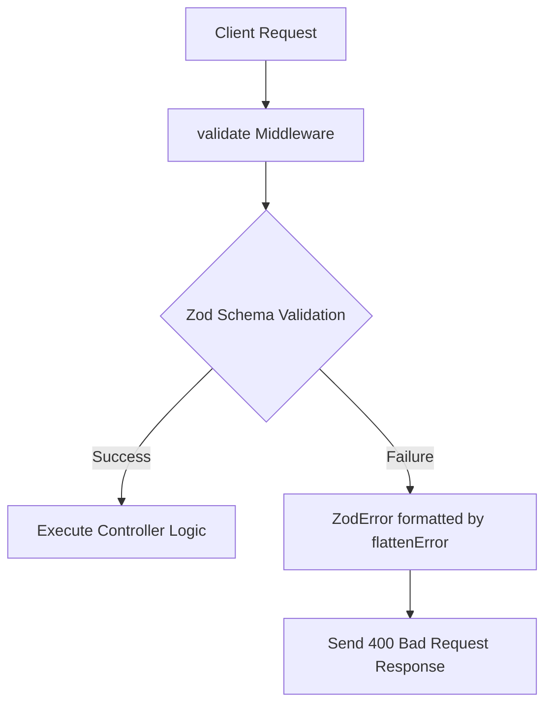

# 🛡️ Request Validation with Zod (Hinglish)

Jab bhi client (mobile app) server par data bhejta hai, toh use accept karne se pehle verify karna bohot zaroori hota hai. Agar hum invalid or malicious data ko direct run karenge, toh app crash ho sakti hai ya server hack ho sakta hai. Is problem ko solve karne ke liye hum **Zod** library use karte hain.

---

## 🧐 Zod Validation Kya Hai?

**Zod ek TypeScript-first schema declaration aur validation library hai.**
* **Schema Declaration**: Hum ek blueprint (schema) define karte hain jo batata hai ki client ko kis type ka data kis format mein bhejna chahiye.
* **Validation**: Jab request aati hai, Zod us request body ko schema ke rules ke against check karta hai. Agar data sahi hai, toh code aage badhta hai; agar galat hai, toh Zod accurate, human-readable error messages generate karke wapas bhej deta hai.

---

## 🚦 Request Validation Flow Diagram



---

## 📚 Zod Common Validators & Functions (Table)

| Zod Method | Purpose | Code Example |
| :--- | :--- | :--- |
| **`z.string()`** | Check karta hai ki input value string hai ya nahi. | `z.string()` |
| **`min(length, message)`** | String ka minimum character limit check karta hai. | `.min(3, "Too short")` |
| **`max(length, message)`** | String ka maximum character limit check karta hai. | `.max(50, "Too long")` |
| **`regex(regexPattern, message)`** | Input value ko custom RegExp pattern se match karta hai (e.g., no spaces, password patterns). | `.regex(noSpaceRegex, "No spaces allowed")` |
| **`email(message)`** | Check karta hai ki input string valid email format hai ya nahi. | `z.string().email("Invalid email")` |
| **`z.object()`** | Nested JSON objects validation ke liye schema object banata hai. | `z.object({ username: z.string() })` |
| **`merge(anotherSchema)`** | Do schemas ke fields ko merge karke ek single schema banane ke liye. | `SchemaA.merge(SchemaB)` |
| **`parseAsync(data)`** | Data ko asynchronous verification process run karta hai. Validation fail hone par validation error throw karta hai. | `await schema.parseAsync(req.body)` |

---

## 💻 Real Project Implementation

PulseSync mein hum Zod validation ko do main layers mein split karte hain: **Schemas Layer** and **Middleware Layer**.

### 1. The Schema Definition Layer ([user.schema.ts](file:///c:/Gaurav/backend/backend-learning/src/schemas/user.schema.ts))
Hum request body, params, ya query ko validate karne ke liye blueprints likhte hain:
```typescript
import { z } from "zod";
import { emailRegex, noSpaceRegex } from "../utils/regex";

// Schema for User Registration
export const RegisterUserSchema = z.object({
  body: z.object({
    username: z.string({ message: "Username is required" })
      .min(3, "Username must be at least 3 characters")
      .regex(noSpaceRegex, "Username cannot contain spaces"),
      
    email: z.string({ message: "Email is required" })
      .regex(emailRegex, "Invalid email format"),
      
    password: z.string({ message: "Password is required" })
      .min(6, "Password must be at least 6 characters"),
  })
});
```

### 2. The Validation Middleware Layer ([validate.middleware.ts](file:///c:/Gaurav/backend/backend-learning/src/middleware/validate.middleware.ts))
Yeh middleware hamesha router file mein controller se pehle call kiya jata hai. Yeh Zod ke throw kiye gaye default error ko parse karke user-friendly format mein change karta hai:
```typescript
import type { Request, Response, NextFunction } from "express";
import { ZodError, ZodObject, flattenError } from "zod";

export const validate = (schema: ZodObject) => {
  return async (req: Request, res: Response, next: NextFunction): Promise<void> => {
    try {
      // 1. Validate req.body, req.query, or req.params against the schema
      const parsed = await schema.parseAsync({
        body: req.body,
        query: req.query,
        params: req.params,
      });
      
      // 2. Overwrite request input parameters with clean, parsed, and validated data
      if (parsed.body) req.body = parsed.body;
      if (parsed.query) Object.assign(req.query, parsed.query);
      if (parsed.params) Object.assign(req.params, parsed.params);
      
      next(); // Validation passed, proceed to controller
    } catch (error) {
      if (error instanceof ZodError) {
        // 3. Flatten errors so that it returns clean error details: { "email": ["Invalid email format"] }
        res.status(400).json({
          success: false,
          message: "Request validation failed",
          errors: flattenError(error).fieldErrors,
        });
        return;
      }
      next(error);
    }
  };
};
```

### 3. How to bind it in Routes ([user.routes.ts](file:///c:/Gaurav/backend/backend-learning/src/routes/user.routes.ts))
Hum router mein middleware add karte hain:
```typescript
import { Router } from "express";
import { register } from "../controllers/user.controller";
import { validate } from "../middleware/validate.middleware";
import { RegisterUserSchema } from "../schemas/user.schema";

const router = Router();

// Validation schema validates inputs before register controller executes
router.post("/register", validate(RegisterUserSchema), register);

export default router;
```

---

## 🌟 Future / Advanced Topics in Validation

1. **`z.enum([...])`**: 
   - Agar kisi field ki value specific limited constants mein se hi ho sakti hai.
   - Example: `role: z.enum(["user", "admin", "moderator"])`.
2. **`z.date()`**: 
   - Automatic ISO Date string verification.
3. **`partial()`**: 
   - Base schema ke saare fields ko temporary optional (`?`) banane ke liye (e.g., Update API schemas).
