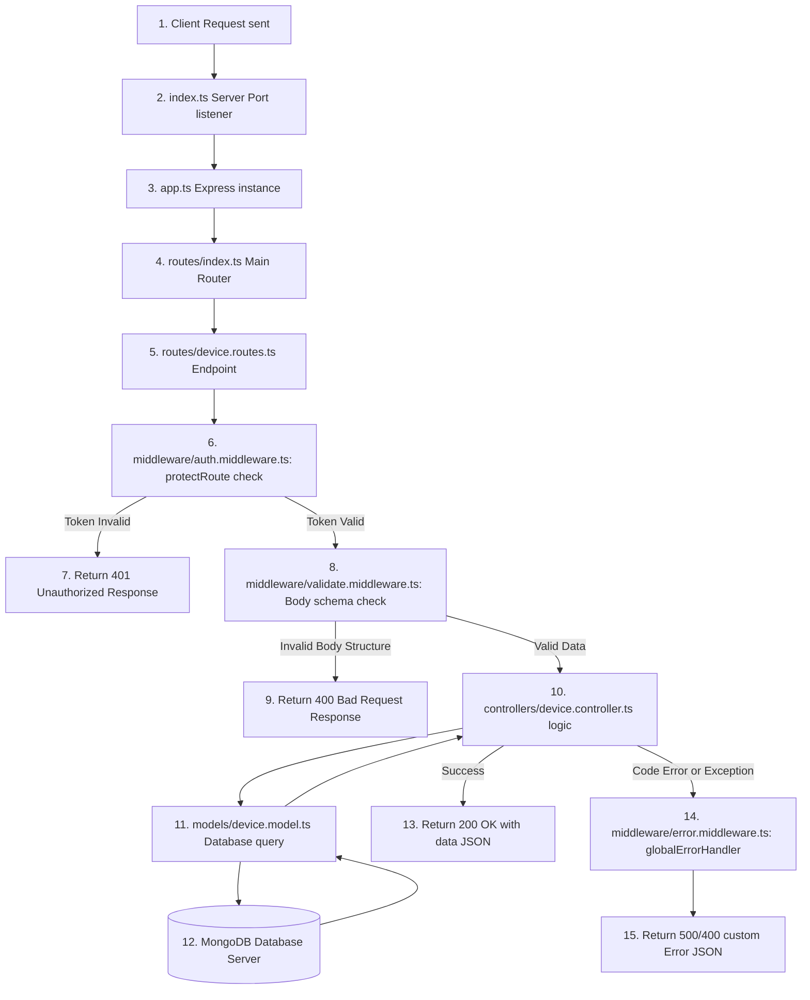

# 🏗️ Project Architecture & MVC Design Pattern (Hinglish)

PulseSync backend project ek standard modular structure follow karta hai jo **MVC (Model-View-Controller)** pattern par based hai (since web-app view client-side mobile app control kar rahi hai, toh view is clean REST API response format).

Chaliye is layer-by-layer structure ko details se samajhte hain taaki future mein aisi hi scales par design templates deploy karna aasan ho jaye.

---

## 🏛️ Project Directory Structure Overview

Aapke project ka core layout is tarah divided hai:

```
backend-learning/
├── index.ts                 # main server loader (db connectivity + listen trigger)
├── src/
│   ├── app.ts               # application engine (global middleware registration)
│   ├── config/              # database configurations
│   ├── routes/              # router mount controllers & define endpoints
│   ├── middleware/          # intercept requests (auth checks, schemas validation, error catch)
│   ├── schemas/             # zod structure for body/query validation
│   ├── controllers/         # business logic (handling requests and returning responses)
│   ├── models/              # database schemas and structures (Mongoose models)
│   ├── interface/           # typescript types definition
│   └── utils/               # custom utilities (app errors, async wrappers)
```

---

## 🌊 Complete Request-Response Flow Diagram

Jab client (mobile app) server ke kisi protected endpoint ko trigger karta hai (jaise `/getdevice?userid=xxx`), toh background call lifecycle kaise perform hoti hai?

Niche iska chronological flow chart dekhiye:



---

## 🧩 Details explanation of each folder/layer

### 1. Main Entrypoint (`index.ts` & `src/app.ts`)
* **`index.ts`**: Yeh file port configure karti hai, database connect karti hai, aur server ko online listening mode par chalu karti hai.
* **`src/app.ts`**: Yeh file pure application controller instances handle karti hai. Isme global settings, parsing middleware (`express.json()`), aur sub-routes import hokar mount hote hain.

### 2. Routes (`src/routes/`)
* **Responsibility**: Endpoints ko path aur specific HTTP methods bind karna.
* **Bad Practice**: Yahan direct db logic or response templates return karna strict bad structure hai.
* **Good Practice**: Routing folder sirf controllers aur validations binding ka bridge hona chahiye.

### 3. Middleware (`src/middleware/`)
* **Responsibility**: Security checks aur standard checks execute karna before database interaction starts.
* **Examples**:
  - `auth.middleware.ts`: Token signature, structure valid verification.
  - `validate.middleware.ts`: Request validation using Zod structure.

### 4. Schemas (`src/schemas/`)
* **Responsibility**: API specifications structure lock karna.
* **Example**: [user.schema.ts](file:///c:/Gaurav/backend/backend-learning/src/schemas/user.schema.ts) define karta hai ki registration ke time password 6+ characters ka hona chahiye. Zod schema errors code level par processing start hone se pehle stop kar di jati hain.

### 5. Controllers (`src/controllers/`)
* **Responsibility**: Application logic process karna. Request se data extract karna, model functions call karna, logical updates execute karna aur clean response standard format banana.

### 6. Models (`src/models/`)
* **Responsibility**: Direct database tables structure mappings aur properties save parameters handle karna (e.g., user schema database rules).

---

## 💡 Why this architecture? (Benefits)
1. **Separation of Concerns (SoC)**: Agar database structure change karna ho, toh controllers ya route levels ka code touch nahi karna padta, sirf model level code tweak hoga.
2. **Reusability**: `protectRoute` middleware ek file mein likha hai, lekin use multiple routes (jaise profile updates, devices data, products lists) par bind kar sakte hain.
3. **Collaboration**: Multiple developers ek project mein simultaneously kaam kar sakte hain bina code conflict ke, kyunki controllers, models, aur schemas clear separate files mein organized hain.
