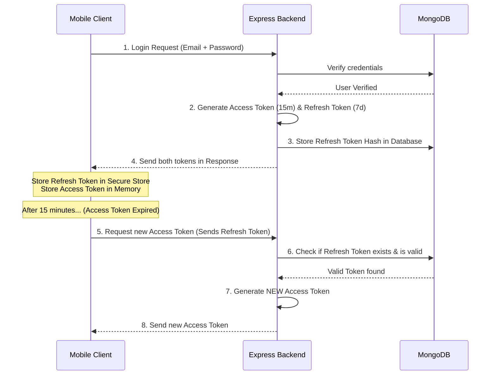

# Advanced JWT: Access Token & Refresh Token Tutorial (Hinglish)

Hello Gaurav! 👋 Mobile app developers ke liye **JWT Refresh Tokens** seekhna aur implement karna sabse zyada important topic hai. 

Is tutorial mein hum detail mein cover karenge ki **Access & Refresh Tokens** kya hote hain, inki zaroorat kyun hai, aur inhein code mein kaise implement kiya jata hai. Is document ko read karke aap iska **PDF** bhi save kar sakte hain (Ctrl + P press karke static page print/save as PDF kar sakte hain).

---

## 🔑 Refresh Token vs Media Upload: Pehle Kya Seekhein?

Aapko **Advanced JWT (Access & Refresh Tokens)** pehle seekhna chahiye. Kyun?
1. **Security Backbone**: Har mobile app ko safe and seamless login experience chahiye hota hai. Media upload secondary feature hai, authorization primary feature hai.
2. **Session Persistence**: Mobile apps mein user baar-baar log out nahi hona chahiye. Refresh token hi aisi technique hai jisse user logged-in rehta hai bina security compromise kiye.

---

## 🛠️ Access Token vs Refresh Token Concept (Hinglish Explanation)

Abhi tak aapne normal JWT implementation kiya hai. Usme aap ek single token banate hain aur user ko de dete hain. Agar wo token leak ho gaya, toh hacker user ke account ko lifetime access kar sakta hai jab tak token expire nahi hota. 

Is security issue ko solve karne ke liye hum **do tokens** use karte hain:

| Token Type | Lifespan (Validity) | Where is it Stored? | Usage |
| :--- | :--- | :--- | :--- |
| **Access Token** | Short-lived (e.g., 10-15 minutes) | Memory (App state) / Secure Store | API Requests handle karne ke liye (authorization headers mein jata hai). |
| **Refresh Token** | Long-lived (e.g., 7 days to 30 days) | Secure Storage (Mobile Keystore/Keychain) & Database (Backend side) | Jab Access Token expire ho jaye, toh naya Access Token request karne ke liye use hota hai. |

---

## 🔄 The Complete Flow (Workflow)



---

## 💻 Step-by-Step Implementation Guide

Aapke existing codebase ke setup ke hisab se implementation steps niche diye gaye hain:

### Step 1: Database Model mein Refresh Token array add karna
Sabse pehle, user model mein `refreshTokens` array store karenge taaki hum verify kar sakein ki refresh token valid hai ya nahi (ya user ko force logout karana ho toh token delete kar sakein).

Apne [user.model.ts](file:///c:/Gaurav/backend/backend-learning/src/models/user.model.ts) schema mein update karein:
```typescript
// src/models/user.model.ts
const userSchema = new mongoose.Schema({
  username: { type: String, required: true },
  email: { type: String, required: true, unique: true },
  password: { type: String, required: true },
  refreshTokens: [{ type: String }] // Array to support login from multiple devices
});
```

### Step 2: Access & Refresh Tokens Generate karna (Login Controller)
Jab user login karega, hum do tokens sign karenge.

[user.controller.ts](file:///c:/Gaurav/backend/backend-learning/src/controllers/user.controller.ts) update:
```typescript
import jwt from "jsonwebtoken";

// Helper function to sign tokens
const generateTokens = async (userId: string, email: string) => {
  const accessToken = jwt.sign(
    { userId, email },
    process.env.JWT_SECRET!,
    { expiresIn: "15m" } // 15 mins expiry
  );

  const refreshToken = jwt.sign(
    { userId, email },
    process.env.JWT_REFRESH_SECRET!, // Dynamic secret for refresh tokens
    { expiresIn: "7d" } // 7 days expiry
  );

  return { accessToken, refreshToken };
};
```

Update your Login Controller logic:
```typescript
export const login = asyncHandler(async (req: Request, res: Response) => {
  const { email, password } = req.body;
  
  // 1. Find user & Verify Password
  const user = await User.findOne({ email });
  if (!user || !(await bcrypt.compare(password, user.password))) {
    throw new AppError("Invalid credentials", 401);
  }

  // 2. Generate Tokens
  const { accessToken, refreshToken } = await generateTokens(user._id.toString(), user.email);

  // 3. Save Refresh Token in Database
  user.refreshTokens.push(refreshToken);
  await user.save();

  // 4. Send Response (Send refresh token to client)
  res.status(200).json({
    success: true,
    data: {
      accessToken,
      refreshToken, // Mobile App stores this in Secure Storage
      userId: user._id
    }
  });
});
```

### Step 3: Refresh Token API Route banana
Humein ek endpoint banana hoga jise mobile app call karega jab uska access token expire ho jayega.

Create a new file `src/controllers/auth.controller.ts` or add to `user.controller.ts`:
```typescript
// POST /auth/refresh
export const refreshAccessToken = asyncHandler(async (req: Request, res: Response) => {
  const { refreshToken } = req.body;

  if (!refreshToken) {
    throw new AppError("Refresh Token is required", 400);
  }

  // 1. Verify Refresh Token
  const decoded = jwt.verify(refreshToken, process.env.JWT_REFRESH_SECRET!) as { userId: string; email: string };

  // 2. Find user and check if token exists in DB
  const user = await User.findById(decoded.userId);
  if (!user || !user.refreshTokens.includes(refreshToken)) {
    throw new AppError("Session expired or invalid refresh token", 403);
  }

  // 3. Generate NEW Access Token (and optionally rotate Refresh Token)
  const newAccessToken = jwt.sign(
    { userId: user._id, email: user.email },
    process.env.JWT_SECRET!,
    { expiresIn: "15m" }
  );

  res.status(200).json({
    success: true,
    data: {
      accessToken: newAccessToken
    }
  });
});
```

### Step 4: Logout Endpoint (Token Removal)
Jab user logout karega, humen database se us specific refresh token ko remove karna hoga.
```typescript
// POST /auth/logout
export const logout = asyncHandler(async (req: Request, res: Response) => {
  const { refreshToken } = req.body;

  // Database se token delete karein
  await User.updateOne(
    { refreshTokens: refreshToken },
    { $pull: { refreshTokens: refreshToken } }
  );

  res.status(200).json({
    success: true,
    message: "Logged out successfully"
  });
});
```

---

## 📱 Mobile App (React Native) Side Integration

Mobile app pe direct axios errors handle karne ke bajaye, hum **Axios Interceptors** use karte hain. 

Agar koi request `401 Unauthorized` return karti hai (meaning access token expire ho gaya), toh interceptor queue pause karta hai, background mein silent `/auth/refresh` request bhejta hai, naya token store karta hai, aur purani request ko automatically naye token ke sath replay kar deta hai. User ko pata bhi nahi chalta!

### React Native Interceptor Example:
```javascript
import axios from 'axios';
import * as SecureStore from 'expo-secure-store'; // or Keychain

const apiClient = axios.create({
  baseURL: 'https://your-api.com',
});

// Request Interceptor: Access Token header mein attach karein
apiClient.interceptors.request.use(async (config) => {
  const token = await SecureStore.getItemAsync('accessToken');
  if (token) {
    config.headers.Authorization = `Bearer ${token}`;
  }
  return config;
});

// Response Interceptor: 401 Error catch karna
apiClient.interceptors.response.use(
  (response) => response,
  async (error) => {
    const originalRequest = error.config;

    // Check if error is 401 and request has not been retried
    if (error.response.status === 401 && !originalRequest._retry) {
      originalRequest._retry = true;

      try {
        const refreshToken = await SecureStore.getItemAsync('refreshToken');
        
        // Request a new Access Token
        const res = await axios.post('https://your-api.com/auth/refresh', { refreshToken });
        const newAccessToken = res.data.data.accessToken;

        // Save new Access Token
        await SecureStore.setItemAsync('accessToken', newAccessToken);

        // Retry original request with new token
        originalRequest.headers.Authorization = `Bearer ${newAccessToken}`;
        return apiClient(originalRequest);
      } catch (refreshError) {
        // Refresh token is also expired/invalid -> Force Logout
        await SecureStore.deleteItemAsync('accessToken');
        await SecureStore.deleteItemAsync('refreshToken');
        // Redirect to Login Screen
      }
    }
    return Promise.reject(error);
  }
);
```

---

## 💡 Important Best Practices (Dhyaan Rakhne Wali Baatein)
1. **Never use the same secret**: `JWT_SECRET` and `JWT_REFRESH_SECRET` hamesha alag hone chahiye.
2. **Refresh Token Rotation (Optional but secure)**: Har baar jab user naya Access Token maange, tab ek naya Refresh Token bhi use generate karke do aur purane wale ko DB se delete kar do. Isse refresh token reuse attack se bacha ja sakta hai.
3. **Always use HTTPS**: Production mein tokens transparent HTTP connections par move nahi karne chahiye taaki Network sniffer access na le sakein.

Aap is guide ko review kijiye, aur jab aap ready honge, tab hum code mein validation & tokens updates implement karna start karenge! Let me know if you have any questions or want to jump into the code files directly. 🚀
